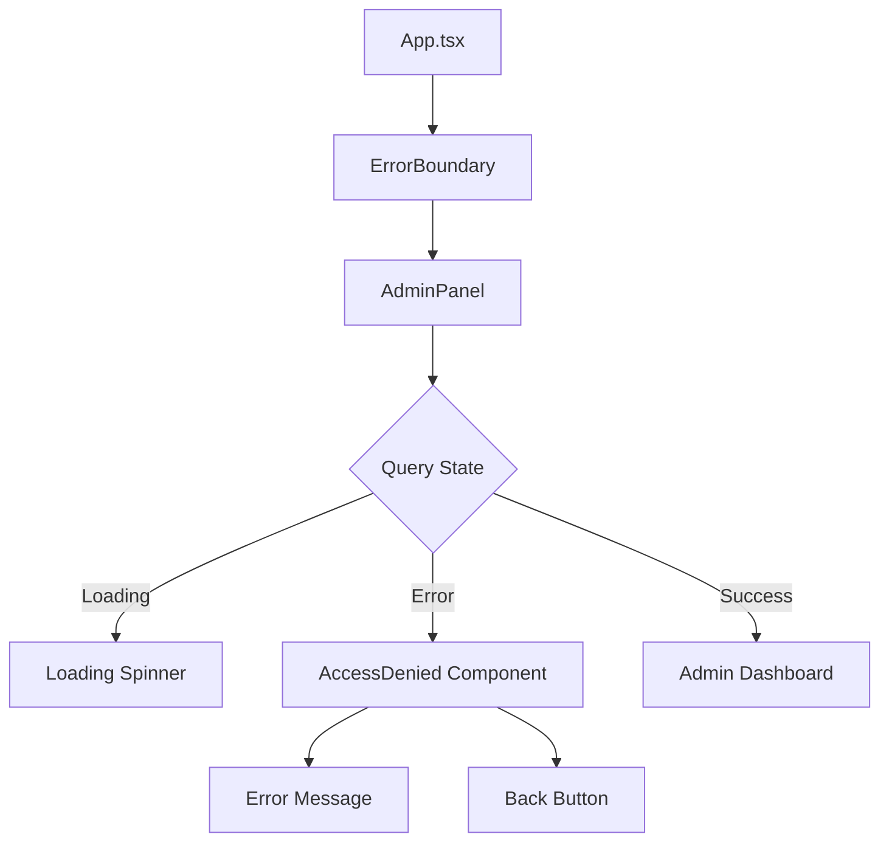
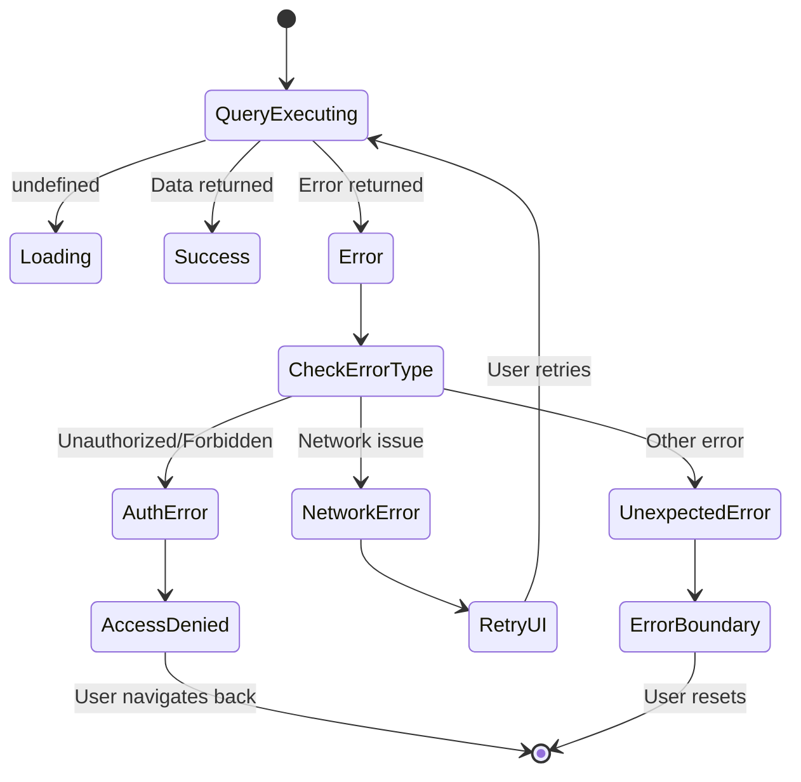

# Design Document: Admin Panel Error Handling

## Overview

This design addresses the critical issue where unauthorized users accessing the Admin Panel encounter a blank white screen due to unhandled authorization errors. The solution implements a multi-layered error handling strategy:

1. **Component-level error handling** - AdminPanel component explicitly handles query errors
2. **Error boundary protection** - React Error Boundary wraps the AdminPanel to catch any unhandled errors
3. **User-friendly error UI** - Clear "Access Denied" message with navigation options
4. **Backend consistency** - Ensure authorization errors are predictable and well-structured

The design maintains backward compatibility with existing admin functionality while preventing application crashes.

## Architecture

### Current Architecture Issues

```
User clicks Admin button
    ↓
AdminPanel renders
    ↓
useQuery(api.admin.getAdminStats) executes
    ↓
Backend throws "Unauthorized" error
    ↓
Error propagates to React
    ↓
No error boundary catches it
    ↓
React unmounts entire component tree
    ↓
BLANK WHITE SCREEN
```

### Proposed Architecture

```
User clicks Admin button
    ↓
ErrorBoundary wraps AdminPanel
    ↓
AdminPanel renders
    ↓
useQuery(api.admin.getAdminStats) executes
    ↓
Backend throws "Unauthorized" error
    ↓
useQuery returns error state
    ↓
AdminPanel checks error state
    ↓
Renders AccessDenied component
    ↓
USER SEES FRIENDLY ERROR MESSAGE
```

### Component Hierarchy



## Components and Interfaces

### 1. ErrorBoundary Component

**Purpose**: Catch any unhandled errors in the Admin Panel component tree and display a fallback UI.

**Location**: `src/components/ErrorBoundary.tsx`

**Interface**:
```typescript
interface ErrorBoundaryProps {
  children: React.ReactNode;
  fallback?: React.ComponentType<{ error: Error; resetError: () => void }>;
}

interface ErrorBoundaryState {
  hasError: boolean;
  error: Error | null;
}

class ErrorBoundary extends React.Component<ErrorBoundaryProps, ErrorBoundaryState> {
  static getDerivedStateFromError(error: Error): ErrorBoundaryState;
  componentDidCatch(error: Error, errorInfo: React.ErrorInfo): void;
  resetError(): void;
  render(): React.ReactNode;
}
```

**Behavior**:
- Catches errors during rendering, in lifecycle methods, and in constructors
- Logs error details to console for debugging
- Renders fallback UI when error occurs
- Provides reset mechanism to attempt recovery
- Does NOT catch errors in event handlers (those should be handled explicitly)

### 2. AccessDenied Component

**Purpose**: Display user-friendly "Access Denied" message with navigation options.

**Location**: `src/components/AccessDenied.tsx`

**Interface**:
```typescript
interface AccessDeniedProps {
  message?: string;
  onNavigateBack?: () => void;
}

function AccessDenied(props: AccessDeniedProps): JSX.Element;
```

**Behavior**:
- Displays clear, non-technical error message
- Shows icon or visual indicator for access denial
- Provides "Go Back" button that navigates to home page
- Maintains consistent styling with application theme
- Accepts optional custom message for flexibility

**Default Message**: "Access Denied. You need administrator privileges to view this page."

### 3. Enhanced AdminPanel Component

**Purpose**: Fetch and display admin statistics with proper error handling.

**Location**: `src/components/AdminPanel.tsx`

**Current Implementation Issues**:
```typescript
// PROBLEMATIC CODE
function AdminPanel() {
  const stats = useQuery(api.admin.getAdminStats);
  // No error checking - crashes if stats is undefined or error occurs
  return <div>{stats.totalUsers}</div>;
}
```

**Enhanced Implementation Pattern**:
```typescript
function AdminPanel() {
  const result = useQuery(api.admin.getAdminStats);
  
  // Explicit state handling
  if (result === undefined) {
    return <LoadingSpinner />;
  }
  
  if (result instanceof Error || (result as any).error) {
    // Check if it's an authorization error
    const errorMessage = result.message || (result as any).error;
    if (errorMessage.includes("Unauthorized") || errorMessage.includes("Access denied")) {
      return <AccessDenied />;
    }
    // Other errors
    return <AccessDenied message={`Error: ${errorMessage}`} />;
  }
  
  // Success state - render admin dashboard
  return <AdminDashboard stats={result} />;
}
```

**Key Changes**:
1. Check for `undefined` (loading state)
2. Check for error states before accessing data
3. Distinguish authorization errors from other errors
4. Render appropriate UI for each state

### 4. Backend Error Handling

**Purpose**: Ensure authorization errors are consistent and properly structured.

**Location**: `convex/admin.ts`

**Current Implementation**:
```typescript
function isAdmin(ctx: QueryCtx | MutationCtx): boolean {
  const user = await ctx.auth.getUserIdentity();
  if (!user || !user.email?.includes("admin")) {
    throw new Error("Unauthorized");
  }
  return true;
}
```

**Enhanced Implementation**:
```typescript
function isAdmin(ctx: QueryCtx | MutationCtx): boolean {
  const user = await ctx.auth.getUserIdentity();
  if (!user) {
    throw new ConvexError({
      code: "UNAUTHORIZED",
      message: "Authentication required"
    });
  }
  if (!user.email?.includes("admin")) {
    throw new ConvexError({
      code: "FORBIDDEN", 
      message: "Admin privileges required"
    });
  }
  return true;
}
```

**Key Changes**:
1. Use `ConvexError` for structured errors
2. Distinguish between authentication (401) and authorization (403)
3. Provide clear error codes for frontend handling
4. Maintain consistent error structure

## Data Models

### Error State Types

```typescript
// Query result can be in one of these states
type QueryResult<T> = 
  | undefined              // Loading
  | T                      // Success
  | ConvexError           // Error from backend

// Convex Error structure
interface ConvexError {
  code: "UNAUTHORIZED" | "FORBIDDEN" | "INTERNAL_ERROR";
  message: string;
}
```

### Component State

```typescript
// ErrorBoundary state
interface ErrorBoundaryState {
  hasError: boolean;
  error: Error | null;
}

// AdminPanel doesn't need local state - uses query result directly
```

## Error Handling

### Error Categories

1. **Authorization Errors** (403 Forbidden)
   - User is authenticated but lacks admin privileges
   - Display: AccessDenied component with standard message
   - Action: Provide navigation back to home

2. **Authentication Errors** (401 Unauthorized)
   - User is not logged in
   - Display: AccessDenied component with "Please log in" message
   - Action: Redirect to login page (future enhancement)

3. **Network Errors**
   - Connection issues, timeout, etc.
   - Display: Generic error message with retry option
   - Action: Provide retry button

4. **Unexpected Errors**
   - Caught by ErrorBoundary
   - Display: Generic error fallback
   - Action: Provide reset/reload option

### Error Handling Flow



### Error Recovery Strategies

1. **Authorization Errors**: No automatic retry (user needs admin role)
2. **Network Errors**: Allow manual retry with exponential backoff
3. **Unexpected Errors**: Provide reset button to remount component
4. **Error Boundary**: Log error and provide fallback UI

## Testing Strategy

The testing strategy combines unit tests for specific error scenarios with property-based tests for universal error handling behaviors.

### Unit Testing Focus

- **Specific error scenarios**: Test exact error messages and UI states
- **Component rendering**: Verify correct UI for each error type
- **Navigation behavior**: Test back button and redirect functionality
- **Error boundary behavior**: Test error catching and fallback rendering
- **Backend error responses**: Test authorization check logic

### Property-Based Testing Focus

- **Universal error handling**: Verify all errors are caught and handled
- **State consistency**: Ensure component state remains valid across error conditions
- **UI rendering**: Verify UI always renders (never blank screen)

### Testing Tools

- **Unit Testing**: Vitest + React Testing Library
- **Property Testing**: fast-check (JavaScript property-based testing library)
- **Test Configuration**: Minimum 100 iterations per property test

### Test Coverage Requirements

1. AdminPanel component with all query states (loading, success, error)
2. AccessDenied component rendering and navigation
3. ErrorBoundary catching errors and rendering fallback
4. Backend authorization checks for admin and non-admin users
5. Integration test: Full flow from button click to error display


## Correctness Properties

A property is a characteristic or behavior that should hold true across all valid executions of a system—essentially, a formal statement about what the system should do. Properties serve as the bridge between human-readable specifications and machine-verifiable correctness guarantees.

### Property 1: Non-admin users see Access Denied UI without crashes

*For any* user without admin privileges, when they attempt to access the Admin Panel, the component should render the AccessDenied UI and remain mounted (not crash or unmount).

**Validates: Requirements 1.1, 1.2**

### Property 2: Access Denied UI provides navigation escape

*For any* rendered AccessDenied component, it should contain a visible, clickable navigation element that allows users to return to the main application.

**Validates: Requirements 1.3, 6.1**

### Property 3: Unauthorized errors trigger Access Denied UI

*For any* query result containing an "Unauthorized" or "Forbidden" error, the AdminPanel component should render the AccessDenied UI instead of attempting to render admin data.

**Validates: Requirements 1.4, 3.3**

### Property 4: Error Boundary catches all component errors

*For any* error thrown within the Admin Panel component tree, the ErrorBoundary should catch it, prevent the page from crashing, display fallback UI, and log the error details.

**Validates: Requirements 2.1, 2.2, 2.3**

### Property 5: All query states handled explicitly

*For any* query result state (undefined/loading, success data, or error), the AdminPanel component should render appropriate UI (loading spinner, admin dashboard, or error message) without attempting to access undefined data.

**Validates: Requirements 3.1, 3.4**

### Property 6: Error messages are user-friendly

*For any* error displayed to users, the message should not contain technical implementation details such as stack traces, file paths, function names, or internal variable names.

**Validates: Requirements 4.3**

### Property 7: Admin users access full functionality

*For any* user with admin privileges, when they access the Admin Panel and the query succeeds, the component should render the complete admin dashboard with all administrative features and statistics.

**Validates: Requirements 5.1, 5.2**

### Property 8: Navigation button triggers redirect

*For any* AccessDenied component with a navigation button, when the button is clicked, the application should navigate to the home page or previous location.

**Validates: Requirements 6.2**

### Property 9: Errors don't break global navigation

*For any* error state in the Admin Panel, the application's global navigation bar should remain functional and allow users to navigate to other pages.

**Validates: Requirements 6.3**

### Property 10: Backend returns consistent error structure

*For any* authorization check failure in the backend, the returned error should be a ConvexError with a consistent structure containing an error code ("UNAUTHORIZED" or "FORBIDDEN") and a descriptive message.

**Validates: Requirements 7.1, 7.2, 7.3**

### Property 11: Error Boundary reset restores functionality

*For any* error caught by the ErrorBoundary, when the reset function is called, the component should remount and attempt to render normally again.

**Validates: Requirements 2.1** (implicit - error recovery)

### Property 12: Component tree structure includes ErrorBoundary

*For the* application component tree, the ErrorBoundary component should wrap the AdminPanel component to provide error protection.

**Validates: Requirements 2.4**

## Implementation Notes

### Key Design Decisions

1. **Multi-layered error handling**: Both component-level (useQuery error checking) and boundary-level (ErrorBoundary) protection ensures maximum resilience.

2. **Explicit state handling**: The AdminPanel component explicitly checks for undefined, error, and success states rather than assuming data is always available.

3. **Structured errors**: Using ConvexError with error codes allows the frontend to distinguish between different error types and handle them appropriately.

4. **User-first approach**: All error messages prioritize user understanding over technical accuracy, avoiding jargon and implementation details.

5. **Graceful degradation**: Even when errors occur, users can always navigate away and continue using other parts of the application.

### Future Enhancements

1. **Role-based access control**: Replace email-based admin check with proper role system
2. **Retry mechanism**: Add retry button for transient network errors
3. **Error telemetry**: Send error reports to monitoring service
4. **Loading states**: Add skeleton screens for better perceived performance
5. **Authentication redirect**: Automatically redirect unauthenticated users to login page
