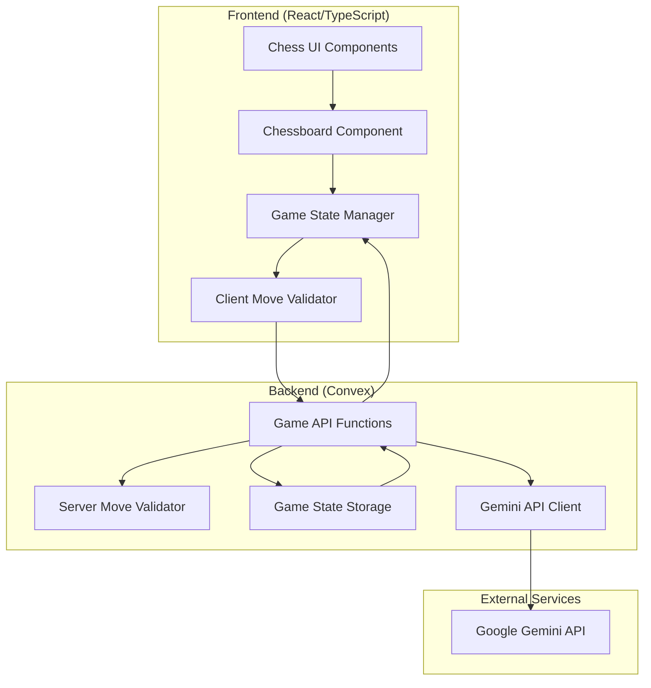

# Design Document: Chess Game with Gemini AI Integration

## Overview

The Chess Game with Gemini AI Integration is a comprehensive educational chess platform that combines a fully-featured chess engine with Google's Gemini AI to provide students with an intelligent opponent. The system follows a client-server architecture where the React/TypeScript frontend handles user interactions and game visualization, while the Convex backend manages game state, move validation, and secure communication with the Gemini API.

The design leverages the chess.js library for core chess logic and FEN notation for board state representation, ensuring compatibility with standard chess formats. The Gemini AI integration uses carefully crafted prompts to generate moves at different difficulty levels while maintaining strict move validation to ensure game integrity.

## Architecture

### High-Level Architecture



### Component Architecture

The system is organized into distinct layers with clear separation of concerns:

**Presentation Layer (React Components)**
- ChessGame: Main game container component
- Chessboard: Interactive board visualization
- GameControls: Game management UI (restart, undo, themes)
- GameStatus: Display current game state and messages
- MoveHistory: Show move sequence and game progression

**Business Logic Layer**
- GameManager: Orchestrates game flow and state transitions
- MoveValidator: Validates moves using chess.js rules
- AIOpponent: Manages Gemini AI integration and difficulty levels
- GamePersistence: Handles local storage and state recovery

**Data Layer (Convex Backend)**
- Game API functions for move processing and validation
- Secure Gemini API integration with prompt engineering
- Game state persistence and retrieval
- Error handling and retry logic

## Components and Interfaces

### Frontend Components

#### ChessGame Component
```typescript
interface ChessGameProps {
  difficulty: 'easy' | 'medium' | 'hard';
  theme: 'light' | 'dark';
  onGameEnd: (result: GameResult) => void;
}

interface GameState {
  fen: string;
  moveHistory: Move[];
  currentPlayer: 'white' | 'black';
  gameStatus: 'playing' | 'check' | 'checkmate' | 'stalemate' | 'draw';
  lastMove?: Move;
}
```

#### Chessboard Component
```typescript
interface ChessboardProps {
  position: string; // FEN notation
  orientation: 'white' | 'black';
  onMove: (move: Move) => void;
  validMoves: string[];
  lastMove?: Move;
  theme: 'light' | 'dark';
}

interface Move {
  from: string;
  to: string;
  promotion?: 'q' | 'r' | 'b' | 'n';
  san: string; // Standard Algebraic Notation
}
```

#### GameManager Service
```typescript
class GameManager {
  private chess: Chess;
  private gameState: GameState;
  
  makeMove(move: Move): Promise<MoveResult>;
  requestAIMove(difficulty: DifficultyLevel): Promise<Move>;
  validateMove(move: Move): boolean;
  getValidMoves(square: string): string[];
  undoLastMove(): boolean;
  restartGame(): void;
  saveGameState(): void;
  loadGameState(): GameState | null;
}
```

### Backend API Functions

#### Game Management Functions
```typescript
// convex/chess.ts
export const makeMove = mutation({
  args: {
    gameId: v.id("games"),
    move: v.object({
      from: v.string(),
      to: v.string(),
      promotion: v.optional(v.string())
    })
  },
  handler: async (ctx, args) => {
    // Validate move and update game state
  }
});

export const requestAIMove = action({
  args: {
    gameId: v.id("games"),
    difficulty: v.union(v.literal("easy"), v.literal("medium"), v.literal("hard"))
  },
  handler: async (ctx, args) => {
    // Generate AI move using Gemini API
  }
});
```

#### Gemini AI Integration
```typescript
interface GeminiChessPrompt {
  systemInstruction: string;
  boardState: string; // FEN notation
  difficulty: DifficultyLevel;
  moveHistory: string[];
}

class GeminiChessClient {
  async generateMove(prompt: GeminiChessPrompt): Promise<string>;
  private buildPrompt(boardState: string, difficulty: DifficultyLevel): string;
  private validateAIMove(move: string, boardState: string): boolean;
}
```

## Data Models

### Game State Schema
```typescript
// convex/schema.ts
export default defineSchema({
  games: defineTable({
    fen: v.string(),
    moveHistory: v.array(v.object({
      from: v.string(),
      to: v.string(),
      san: v.string(),
      timestamp: v.number()
    })),
    currentPlayer: v.union(v.literal("white"), v.literal("black")),
    gameStatus: v.union(
      v.literal("playing"),
      v.literal("check"),
      v.literal("checkmate"),
      v.literal("stalemate"),
      v.literal("draw")
    ),
    difficulty: v.union(v.literal("easy"), v.literal("medium"), v.literal("hard")),
    playerColor: v.union(v.literal("white"), v.literal("black")),
    createdAt: v.number(),
    updatedAt: v.number()
  })
});
```

### Move Validation Model
```typescript
interface MoveValidation {
  isValid: boolean;
  error?: string;
  resultingFen?: string;
  gameStatus?: GameStatus;
  capturedPiece?: string;
}

interface GameResult {
  winner: 'white' | 'black' | 'draw';
  reason: 'checkmate' | 'stalemate' | 'resignation' | 'timeout';
  moveCount: number;
  duration: number;
}
```

### Gemini Prompt Engineering

The system uses structured prompts to ensure Gemini generates valid chess moves:

```typescript
const GEMINI_CHESS_PROMPTS = {
  systemInstruction: `You are a professional chess engine. You must respond with only a valid chess move in standard algebraic notation (SAN). 
  
  Rules:
  - Analyze the board position provided in FEN notation
  - Generate only legal moves according to chess rules
  - Consider the specified difficulty level
  - Respond with only the move (e.g., "Nf3", "e4", "O-O")
  - Never explain your reasoning, only provide the move`,
  
  difficultyPrompts: {
    easy: "Play at beginner level. Make reasonable but not optimal moves. Occasionally miss tactical opportunities.",
    medium: "Play at intermediate level. Look for basic tactics and positional play. Make good but not perfect moves.",
    hard: "Play at advanced level. Calculate deeply, find the best moves, and exploit all tactical and positional opportunities."
  }
};
```

## Correctness Properties

*A property is a characteristic or behavior that should hold true across all valid executions of a system—essentially, a formal statement about what the system should do. Properties serve as the bridge between human-readable specifications and machine-verifiable correctness guarantees.*

Before defining the correctness properties, I need to analyze the acceptance criteria from the requirements document to determine which ones are testable as properties.

Based on the prework analysis, I'll now define the key correctness properties that ensure the chess game functions correctly:

### Property 1: Move Validation Consistency
*For any* chess position and proposed move, the move validator should return the same result whether validating on the frontend or backend, and all invalid moves should be rejected with appropriate error messages.
**Validates: Requirements 1.2, 5.1, 5.2, 5.3**

### Property 2: Game State Detection Accuracy
*For any* chess position, the chess engine should correctly identify the game state (normal play, check, checkmate, stalemate) based on the current board position and available legal moves.
**Validates: Requirements 1.3, 1.4, 1.8**

### Property 3: Special Chess Rules Implementation
*For any* board position where special moves are applicable (castling, en passant, pawn promotion), the chess engine should correctly enforce the rules and only allow legal special moves.
**Validates: Requirements 1.5, 1.6, 1.7**

### Property 4: AI Move Generation and Validation
*For any* valid chess position and difficulty level, the AI system should generate only legal moves that are validated before application to the board.
**Validates: Requirements 2.1, 2.2, 2.3, 2.4, 5.5**

### Property 5: Move History Integrity
*For any* sequence of moves in a game, the move history should accurately record all moves in order, and undo operations should only affect the most recent user move without corrupting the sequence.
**Validates: Requirements 4.1, 4.2, 5.6**

### Property 6: Game State Persistence
*For any* game state, saving and loading the state should preserve all game information including board position, move history, current player, and game status.
**Validates: Requirements 4.3, 7.3**

### Property 7: Turn Enforcement
*For any* game state, only the current player should be allowed to make moves, and the turn should alternate correctly between players after each valid move.
**Validates: Requirements 5.4**

### Property 8: UI State Synchronization
*For any* game state change, the UI should accurately reflect the current board position, valid moves for selected pieces, and game status indicators.
**Validates: Requirements 3.2, 3.6, 4.6**

### Property 9: Error Handling Resilience
*For any* error condition (invalid moves, API failures, network issues), the system should handle errors gracefully without crashing and provide appropriate user feedback.
**Validates: Requirements 7.1, 7.4, 7.5, 7.6**

## Error Handling

The system implements comprehensive error handling across all layers:

### Frontend Error Handling
- **Move Validation Errors**: Invalid moves are caught before sending to backend
- **Network Errors**: API failures trigger retry logic and user notifications
- **Component Errors**: React error boundaries prevent crashes and show fallback UI
- **State Corruption**: Game state validation prevents invalid states from persisting

### Backend Error Handling
- **API Integration Errors**: Gemini API failures trigger exponential backoff retry
- **Move Validation Errors**: Server-side validation provides additional security
- **Database Errors**: Convex error handling ensures data consistency
- **Authentication Errors**: Secure API key management prevents unauthorized access

### Error Recovery Strategies
```typescript
interface ErrorRecovery {
  retryAttempts: number;
  backoffStrategy: 'exponential' | 'linear';
  fallbackBehavior: 'local-only' | 'restart-game' | 'show-error';
  userNotification: string;
}

const ERROR_STRATEGIES = {
  geminiApiFailure: {
    retryAttempts: 3,
    backoffStrategy: 'exponential',
    fallbackBehavior: 'show-error',
    userNotification: 'AI opponent temporarily unavailable. Please try again.'
  },
  moveValidationFailure: {
    retryAttempts: 0,
    backoffStrategy: 'linear',
    fallbackBehavior: 'local-only',
    userNotification: 'Invalid move. Please select a legal move.'
  },
  networkFailure: {
    retryAttempts: 2,
    backoffStrategy: 'exponential',
    fallbackBehavior: 'local-only',
    userNotification: 'Connection lost. Game state saved locally.'
  }
};
```

## Testing Strategy

The chess game employs a comprehensive dual testing approach combining unit tests for specific scenarios and property-based tests for universal correctness guarantees.

### Unit Testing Approach
Unit tests focus on specific examples, edge cases, and integration points:

- **Chess Engine Tests**: Verify specific game scenarios (famous checkmate patterns, complex positions)
- **UI Component Tests**: Test user interactions, theme switching, and error states
- **API Integration Tests**: Mock Gemini API responses and test error handling
- **Game State Tests**: Verify persistence, loading, and state transitions

### Property-Based Testing Approach
Property tests verify universal properties across randomized inputs with minimum 100 iterations per test:

- **Move Validation Properties**: Generate random positions and moves to test validation consistency
- **Game State Properties**: Test state detection across thousands of generated positions
- **AI Integration Properties**: Verify AI move generation and validation with various board states
- **Persistence Properties**: Test save/load functionality with random game states

### Testing Configuration
Each property-based test will be configured as follows:
- **Minimum iterations**: 100 per test to ensure comprehensive coverage
- **Test tagging**: Each test references its corresponding design property
- **Tag format**: `Feature: chess-game-gemini, Property {number}: {property_text}`
- **Library selection**: Use `fast-check` for TypeScript property-based testing
- **Integration**: Property tests run alongside unit tests in the same test suite

### Test Data Generation
The testing strategy includes sophisticated generators for:
- **Random chess positions**: Generate valid FEN strings for various game states
- **Move sequences**: Create realistic game progressions for testing
- **Edge cases**: Generate positions with special moves, check, checkmate, stalemate
- **Error conditions**: Simulate API failures, network issues, and invalid inputs

### Coverage Requirements
- **Unit test coverage**: Minimum 90% line coverage for critical game logic
- **Property test coverage**: All correctness properties must have corresponding tests
- **Integration coverage**: End-to-end tests for complete game flows
- **Error path coverage**: All error handling paths must be tested

The dual testing approach ensures both concrete correctness (unit tests) and universal properties (property tests), providing comprehensive validation of the chess game's behavior across all possible scenarios.